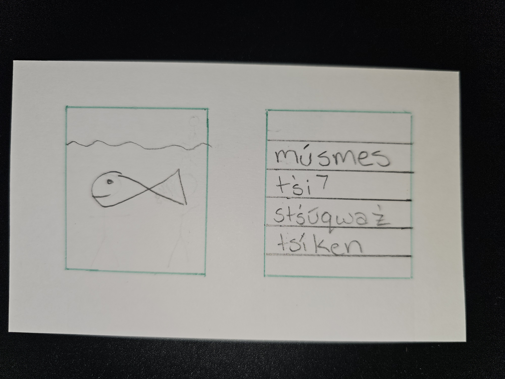
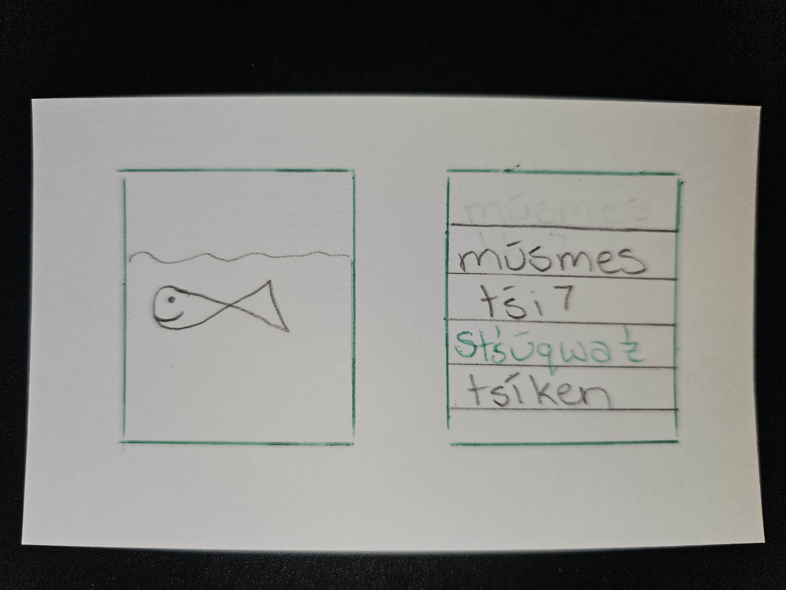
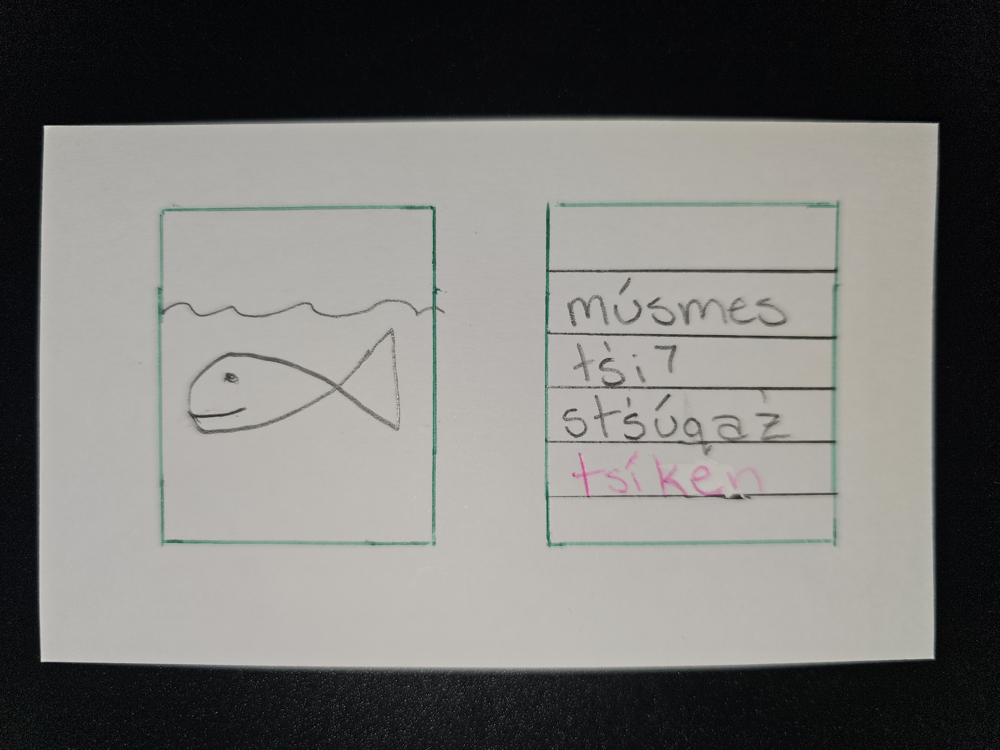

# Project Title

Zewátetcal

## Overview

I would like to make a site to learn St̓át̓imcets. I would like to have like to 2 boxes and on one box it shows an image of someone doing something(like putting on a coat) and in the other box give options of what they are doing. Like a little flash card quiz thing.

### Problem

There is an app that uses my language but it is more for searching word/phrases. I would like something that people can play with that uses more daily phrases to practice. My language does not have many fluent speakers left. Inside my community we don't have any and we are learning other communities dialects. So I would like to contribute to the revitalization of my language.

### User Profile

I would like it used by my community. I know there are mostly elders and children who learn. So I plan to keep it simple and easy to navigate. I think most of the elders have a lot of struggle trying to use the language site we have and they usually like things that are repetative.

### Features

Learning will see two containers one with an image and another with St̓át̓imcets with about 3-5 words/phrases. They then will be able to choose a written option to that matched the picture. I will also have a video feature for learners to practice the sounds.

## Implementation

### Tech Stack

React
JSX
Express

### APIs

List any external sources of data that will be used in your app.

### Sitemap

List the pages of your app with brief descriptions. You can show this visually, or write it out.

### Mockups

### Data

Describe your data and the relationships between them. You can show this visually using diagrams, or write it out.

### Endpoints

GET /activies
get /language-videos

### Auth

No authentication will be necessary

## Roadmap

Set up React with routes and boilerplate pages
have wo main pages one with learning language sounds and the other page for a match picture to proper St̓át̓imcets words/phrases

Set up an Express project with routing, providing responses with basic server working

Set up migrations for database design and implement seeds with sample image-word matching and language learning data

Collect images and corresponding words/phrases for 3-5 options and get language learning videos

Make image to word/phrase page for users to match images with the correct word/phrase.
Store the selected options in sessionStorage.

Implement the Language Learning page with video playback for learning language sounds.
a GET endpoint for retrieving video data

fix any issues or bugs

testing of the application

## Nice-to-haves

another page of cards showing basic conversations

